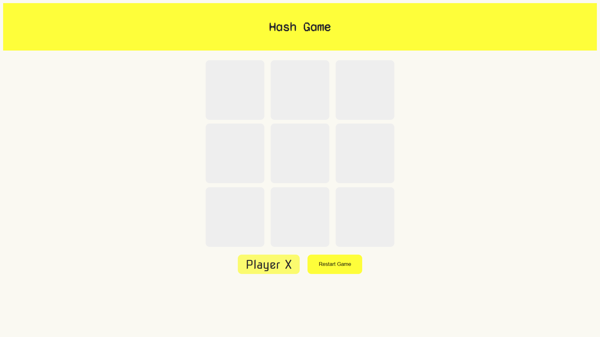
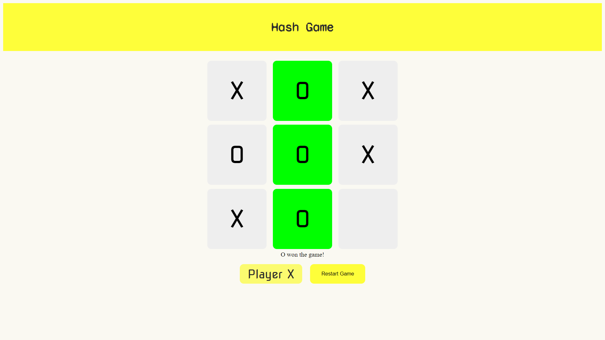

# Hash Game

Project provided in Javascript Developer Bootcamp by Digital Innovation One

From a paper to a website.

In this project, we built the tic-tac-toe (Hash game), using only HTML to structure the website, CSS to style it, and Javascript to create all of interactions, from the player's choice, making a move and giving the game a winner. The basic concepts about languages and how we can create very simple projects were covered, we built it just using basic functions and a little logic!

# Tecnologies

HTML5 | CSS3 | Javascript ES6

# Author

Riller Beata
